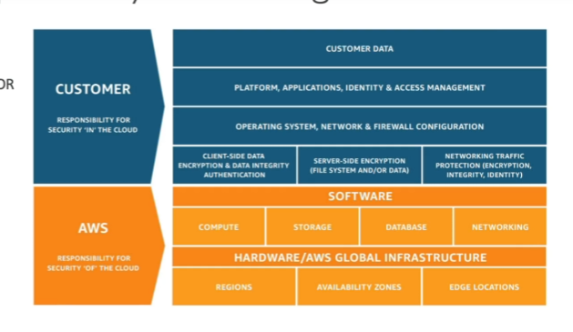

# Cloud Computing Fundamentals

## 🧠 Computer Analogy

| Component  | Analogy |
|------------|---------|
| CPU + Memory (RAM) | Brain |
| Storage | Data |
| Database | Structured data storage |
| Network | Cables, routers, switches, DNS servers |

### Network Components
- **Network**: Cables, routers, and servers connected together.
- **Router**: Forwards data packets between computer networks; knows where to send packets on the internet.
- **Switch**: Receives a packet and sends it to the correct server or client within your network.

---

## ☁️ What is Cloud Computing?

- **On-demand delivery** of compute power, database storage, applications, and other IT resources.
- **Pay-as-you-go pricing** model.
- Provision **exactly the right type and size** of computing resources needed.
- Access resources **instantly and at scale**.
- Provides a **simple way to access** servers, storage, databases, and application services via a web application.

> **Note:** Providers like AWS own and maintain the network-connected hardware required for these services while you provision and use what you need.

---

## 🌐 Cloud Deployment Models

| Model | Description |
|-------|-------------|
| **Private Cloud** | Cloud services used by a single organization, not exposed to the public. |
| **Public Cloud** | Services operated by third parties and delivered over the internet (e.g., AWS, Azure, GCP). |
| **Hybrid Cloud** | Combination of on-premises infrastructure with cloud services for extended capabilities. |

---

## ⭐ Five Characteristics of Cloud

1. **On-demand self-service**: Provision resources without human interaction.
2. **Broad network access**: Resources accessible over the network via diverse client platforms.
3. **Multi-tenancy & Resource pooling**: Multiple customers share infrastructure securely.
4. **Rapid elasticity & scalability**: Scale resources up/down quickly as needed.
5. **Measured service**: Usage is monitored and billed accordingly.

---

## ✅ Advantages of Cloud Computing

1. Trade **CAPEX for OPEX** (Reduced Total Cost of Ownership).
2. Benefit from **massive economies of scale**.
3. **Stop guessing capacity**, scale based on actual usage.
4. Increase **speed and agility**.
5. **Stop spending** money on running and maintaining data centers.
6. **Go global in minutes**.

---

## 🔧 Problems Solved by Cloud

- **Flexibility**: Change resource types as needed.
- **Cost-effectiveness**: Pay only for what you use.
- **Scalability**: Handle larger loads via stronger hardware or additional nodes.
- **Elasticity**: Scale out and in dynamically.
- **High availability & fault tolerance**: Build services across data centers.

---

## 🛠️ Types of Cloud Services

| Type | Description |
|------|-------------|
| **IaaS** (Infrastructure as a Service) | Provides building blocks for cloud IT (networking, compute, storage). Highest flexibility; parallels traditional on-prem IT. |
| **PaaS** (Platform as a Service) | Removes the need to manage underlying infrastructure; focus on deploying and managing applications. |
| **SaaS** (Software as a Service) | Completed products run and managed by the service provider. |

---

### 📌 Summary

Cloud computing provides scalable, flexible, and cost-effective IT resources accessible over the internet with minimal management effort, enabling businesses to innovate and operate efficiently at global scale.


# Cloud Service Models Responsibility Table

| Component        | On-Premises | IaaS                | PaaS                 | SaaS                |
|------------------|-------------|---------------------|----------------------|---------------------|
| Applications     | You         | You                 | You                  | Provider            |
| Data             | You         | You                 | You                  | Provider            |
| Runtime          | You         | You                 | Provider             | Provider            |
| Middleware       | You         | You                 | Provider             | Provider            |
| Operating System | You         | You                 | Provider             | Provider            |
| Virtualization   | You         | Provider            | Provider             | Provider            |
| Servers          | You         | Provider            | Provider             | Provider            |
| Storage          | You         | Provider            | Provider             | Provider            |
| Networking       | You         | Provider            | Provider             | Provider            |

✅ **Key:**
- **You** manage it yourself.
- **Provider** (Managed by others) is managed by the cloud provider.

> This table shows how responsibility shifts from **fully self-managed in On-Premises** to **fully provider-managed in SaaS**, with IaaS and PaaS offering intermediate levels of management.

## Examples of Each type :

### IaaS

1. Amazon EC2
2. GCP, AZURE, RACKSPACE, DIGITAL OCEAN, LINODE

### PaaS

1. Elastic Beanstalk (on AWS)
2. Heroku, Google App Engine (GCP), Windows Azure (Microsoft)

### Software as a Service
1. Many AWS services (Ex: Rekognition for Machine Learning)
2. Google Apps(Gmail), Dropbox, Zoom

---

## Pricing on Cloud- Quick Overview

### AWS gas 3 pricing fundamentals, following the pay-as-you-go pricing model

1. **Compute** : Pay for the compute time
2. **Storage** : Pay for the data stored in the Cloud
3. **Data transfer OUT of the Cloud**: Data transfer IN is free.

---

### AWS Region Choices

1. **Compliance**: With data governance and legal requirments: data never leaves a region without your explicit permission.
2. **Proximity to customers**: reduced latency
3. **Available Services**: Within a Region, new services and new features may or may not be available.
4. **Pricing**: pricing varies region to region and is transparent in the service pricing page.
5. **Avilability Zones** : Each region has many availability zones (usually 3, min is 3, max is 6). Each AZ is one or more discrete data centers with redundant power, networking, and connectivity 

> Global Services and Region-Scoped

---

## Shared Responsibility Model diagram

Customer: Responsibility for Security "IN" the CLOUD.
AWS: Responsibility for Security "OF" the CLOUD.



---

## AWS Acceptable Use Policy Examples

1. No Illegal, Harmful, or Offensive Use Or Content
2. No Security Violations
3. No Network Abuse
4. No E-Mail or Other Message Abuse


---

## IAM

### Identity and Access Management : Users and Groups
1. Global Service
2. Root account created by default, shouldn't be used or shared
3. Users are people within your org, and can be grouped.
4. Users don't have to belong to a group(Not the best practice), and user can belong to multiple groups.

Why users ? => To give them permissions to use services
Users can be assigned JSON documents called policies


Group level policies will be applied to all the members of the group

**Inline policy** is only attached to the User

If the same user belong to a different groups, they will have 2 different policies

### IAM POLICY STRUCTURE

```json
    {
        "Version" : "", // Policy language version, always include "2012-10-17"
        "ID" : "", // An identifier for the policy optional
        "Statement" : [ // One or More individual statements (Required)
            {
                "Sid" : "", // identifier for the statement optional
                "Effect" : "", // weather the statement allows or denies Access (Allow, Deny)
                "Principal" : { // account/user/role to which the policy applied to
                    "AWS" : [""]
                },
                "Action" : [ // list of actions this policy allows or denies

                ],
                "Resource": [] // List of resources to which the actions applied to
            }
        ]
    }


```

